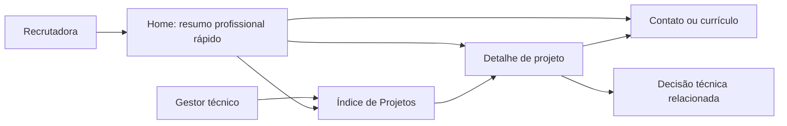

# Auditoria da experiência de recrutadores no portfólio de Carlos Dutra

[English version](recruiter-experience-audit.md)

_Revisão: 27/09/2026 · Escopo: conteúdo, arquitetura da informação e jornada de recrutamento · Linha de base: site de página única antes da funcionalidade 002_

As observações sobre a página única documentam a versão anterior. A [funcionalidade 002](../specs/002-recruiter-project-journey/spec.md) criou a jornada de projetos aprovada; a [funcionalidade 003](../specs/003-remove-challenge-compass/spec.md) retira a Bússola de Desafios depois da rejeição de Carlos. Currículo e outras ideias futuras seguem como trabalho separado.

## 1. Avaliação geral

**“Selected Work” é um título adequado para este portfólio.** É curto, profissional e representa bem os quatro projetos desenvolvidos em empresas: um assistente, uma plataforma de dados, modelagem de CRM e dimensionamento de mercado. “Projects” também seria compreensível, mas trocar apenas o nome da seção teria pouco efeito. A oportunidade maior é permitir que o leitor identifique imediatamente, em cada projeto, empresa, iniciativa, problema de negócio, contribuição de Carlos e evidências de valor. A recomendação é manter os quatro projetos aprovados e sua ordem atual.

**Direção confirmada por Carlos:** a home é para a recrutadora ler rapidamente. Casos completos e decisões técnicas devem ficar em páginas próprias, acessíveis por links claros. O gestor técnico precisa conseguir abrir diretamente o índice de Projetos, escolher um caso e aprofundar a leitura. A estrutura com várias páginas e a home concisa são requisitos; URLs exatas e ordem dos blocos curtos da home continuam escolhas de desenho.

A página já tem uma base sólida: apresenta Carlos como Senior Data Engineer, explica a passagem do contexto de negócios para a engenharia, identifica empresas e projetos, diferencia a contribuição individual da descrição do trabalho, agrupa ferramentas por finalidade, oferece inglês e português brasileiro e permite chegar ao contato a partir da abertura. A personalidade aparece na voz do texto e em doses discretas de humor.

O principal problema para recrutadores é a **arquitetura de página única**. A home contém quatro descrições de projetos seguidas de quatro Notas de Engenharia detalhadas antes das ferramentas e da trajetória profissional. Na página em inglês analisada, Selected Work contém aproximadamente 280 palavras e as Notas de Engenharia, cerca de 490. Essas narrativas merecem páginas próprias: sua presença na home exige atenção técnica antes de responder a perguntas rápidas sobre cargos, ferramentas, resultados e currículo. As contagens são aproximadas, obtidas do texto extraído da página publicada e incluem títulos e rótulos; comparam o volume de leitura e não são uma medição de usabilidade.

**Direção recomendada:** transformar a home numa apresentação rápida para recrutadores e criar um índice de Projetos com uma página própria para cada um dos quatro trabalhos aprovados. As decisões técnicas devem ficar nas páginas dos projetos correspondentes ou em páginas de notas técnicas ligadas a eles. A recrutadora deve compreender o perfil sem abrir um projeto; o gestor técnico deve conseguir ir diretamente aos Projetos, escolher um caso e ler ali o raciocínio completo. A experiência e as competências devem ficar mais acessíveis, e o currículo deve ter download em um clique quando houver arquivo aprovado. O texto da seção Sobre e a legenda da foto, aprovados pelo usuário, devem ser preservados.

## 2. Material analisado e limites da avaliação

Esta auditoria usa o [portfólio publicado](https://carloshenriquedutra.github.io/portfolio/) consultado novamente em 27/09/2026, o `index.html` atual, os módulos de conteúdo em inglês e pt-BR, o CSS, o `about-me.md` e o `todo.md` deste repositório no commit `99cd22c`. A nova consulta foi necessária porque uma primeira extração em cache retornou uma versão anterior do site. As recomendações tratam da versão atual, com os quatro projetos aprovados e o texto atualizado da seção Sobre.

A análise também considera a [pesquisa do Nielsen Norman Group sobre leitura por títulos](https://www.nngroup.com/articles/layer-cake-pattern-scanning/), as [orientações da Intuit sobre portfólios de engenharia](https://www.intuit.com/blog/global-stories/software-engineer-portfolio/), a [distinção feita pela Arc entre necessidades de recrutadores e gestores técnicos](https://arc.dev/talent-blog/software-engineer-portfolio/) e as orientações do [W3C sobre títulos](https://www.w3.org/WAI/tutorials/page-structure/headings/) e [propósito dos links](https://www.w3.org/WAI/WCAG22/Understanding/link-purpose-in-context.html). Essas fontes fundamentam recomendações gerais; elas não demonstram como um recrutador específico reagirá a esta página.

Não foram realizados entrevistas com recrutadores, análise de tráfego ou conversão, estudo cronometrado de leitura, revisão visual completa em diferentes larguras de tela nem teste de acessibilidade. Os pontos marcados como **verificar visualmente** foram inferidos a partir do HTML e do CSS e precisam de confirmação no navegador antes de qualquer implementação.

## 3. Dois públicos e suas primeiras perguntas

O site atende, no mínimo, a dois públicos. A Arc distingue explicitamente a triagem de um recrutador, que procura experiência relevante, da avaliação de um gestor técnico, que examina como e por que decisões de engenharia foram tomadas. A página precisa oferecer um percurso curto aos dois, com detalhes disponíveis para quem quiser aprofundar. [Fonte: Arc](https://arc.dev/talent-blog/software-engineer-portfolio/).

| Leitor | Perguntas que precisa responder cedo | Percurso atual | Atrito |
|---|---|---|---|
| Recrutador | Quem é Carlos? Qual cargo exerce? Quais empresas, períodos e ferramentas correspondem à vaga? Há currículo e um canal confiável de contato? | Abertura → Sobre → quatro projetos → quatro notas longas → ferramentas → carreira → formação → contato | Histórico profissional e ferramentas aparecem depois do bloco técnico mais extenso. Não há link para currículo. |
| Gestor técnico | O que Carlos construiu pessoalmente? Qual problema resolveu? Que alternativas e compromissos avaliou? Qual evidência ou situação atual do projeto? | Abertura → projetos → notas | O raciocínio é substancial, mas nenhum cartão leva a um estudo de caso, artefato ou nota relacionada; resultados concretos e situação dos projetos aparecem de forma desigual. |
| Recrutador no celular | Consigo identificar o profissional e realizar a próxima ação imediatamente? | Navegação → retrato e legenda → mensagem principal → botões | Em telas estreitas, o retrato aparece antes do título principal; a moldura grande pode empurrar o título e os botões para fora da primeira tela. **Verificar visualmente.** |

O objetivo não é encurtar todas as seções. É permitir que a primeira leitura responda às perguntas do recrutador e ofereça aprofundamento ao leitor técnico interessado. A pesquisa do Nielsen Norman Group indica que títulos descritivos e blocos de conteúdo bem separados ajudam as pessoas a localizar o trecho relevante para sua tarefa. [Fonte: NN/g](https://www.nngroup.com/articles/layer-cake-pattern-scanning/).

## 4. Arquitetura atual da informação

A página publicada segue esta ordem:

1. Navegação fixa: About, Selected Work, Experience, Contact e troca de idioma.
2. Abertura: proposta de valor, dois parágrafos complementares, ações de projetos e contato, retrato e legenda com o cargo.
3. Sobre: dois parágrafos sobre a trajetória RevOps → Data Analytics → Data Engineering.
4. Selected Work: quatro cartões, na ordem Lumi, plataforma de People Analytics, modelagem de CRM HubSpot e dimensionamento de mercado da COPAPA.
5. Engineering Notes: quatro decisões detalhadas dentro da seção de projetos.
6. Toolbox: cinco grupos de tecnologias e áreas de negócio.
7. Career: quatro experiências, com rótulos amplos de atuação e resumos de uma frase.
8. Education: três formações.
9. Contact: e-mail, LinkedIn, GitHub e WhatsApp, seguidos de uma frase pessoal no rodapé.

Essa sequência já contempla quase todo o conteúdo essencial. Sua transição mais fraca ocorre entre os itens 4 e 7: o visitante passa por uma segunda explicação longa de projetos semelhantes antes de chegar às competências e à carreira. A navegação reduz parte do problema porque há uma âncora direta para Experience, mas não existe um item de navegação para Skills, e as Notas de Engenharia não são apresentadas claramente como aprofundamento opcional.

## 5. O que funciona e deve ser mantido

| Elemento | Por que funciona | O que preservar ao refinar |
|---|---|---|
| Quatro projetos selecionados | Eles mostram uma variedade útil: IA aplicada, arquitetura de plataforma, engenharia analítica e análise ligada a decisões comerciais. Quatro está dentro da sugestão da Intuit de apresentar três a cinco projetos fortes. [Fonte: Intuit](https://www.intuit.com/blog/global-stories/software-engineer-portfolio/). | Manter os quatro projetos, os nomes das empresas e a ordem aprovada. |
| Título “Selected Work” | Abrange produtos e iniciativas de experiências profissionais sem sugerir que tudo seja um projeto pessoal de código aberto. | A troca de nome é opcional; primeiro, melhorar os títulos e cartões dos projetos. |
| Nome e cargo abaixo da foto | “Carlos Dutra, Senior Data Engineer” é direto e corresponde à redação aprovada pelo usuário. | Manter o formato em uma linha, com vírgula; não recolocar acima do H1 o rótulo de cargo removido anteriormente. |
| Texto aprovado da seção Sobre | Explica por que RevOps e Analytics importam para o trabalho atual de engenharia e dá coerência à trajetória. | Preservar o conteúdo e a redação aprovada em inglês, com versão fiel em pt-BR. |
| Rótulos de contribuição | “The work” e “My contribution” diferenciam o propósito do projeto da atuação de Carlos e reduzem atribuições ambíguas de resultados coletivos. | Tornar problema de negócio e valor mais fáceis de localizar; manter explícita a contribuição individual. |
| Decisões de engenharia | Mostram julgamento técnico, restrições, alternativas e compromissos, além de uma lista de tecnologias. | Manter o conteúdo como leitura aprofundada, vinculado ao projeto correspondente. |
| Ferramentas agrupadas | Grupos ajudam a localizar tecnologias relevantes mais rapidamente que uma parede de logotipos. | Manter os grupos e aproximar as competências mais importantes do início da página. |
| Contato direto e escolha de idioma | O botão da abertura leva ao contato e o cabeçalho oferece inglês e pt-BR. O HTML inicial em inglês também é compreensível sem o script de conteúdo. | Manter os dois idiomas completos e o caminho de contato evidente. |
| Voz e rodapé | O tom é humano sem transformar o portfólio em um diário pessoal. | Preservar a personalidade discreta; não substituir evidências concretas por slogans. |

## 6. Achados por seção

### 6.1 Abertura e primeira tela

**Situação atual:** O H1 apresenta o que Carlos constrói, a legenda da foto informa nome e cargo e dois botões levam aos projetos e ao contato. É um começo consistente. No `index.html`, H1, legenda e ações permitem uma primeira leitura clara. A página usa um H1 e títulos H2 para as seções, uma hierarquia estrutural sensata.

**Ponto de atenção:** A abertura comunica a proposta de valor, mas não oferece acesso direto ao currículo. O cargo fica visível ao lado da foto no desktop; no celular, o retrato é explicitamente colocado antes do H1 e a moldura pode se aproximar da largura do contêiner. Isso pode atrasar a mensagem principal e a primeira ação no celular. É um risco inferido do layout, não uma falha observada no navegador.

**Recomendação:** Preservar o H1, o retrato e a legenda aprovada. Quando o currículo existir, acrescentar “Download résumé (PDF)” ou rótulo equivalente perto da abertura. Verificar a primeira tela em larguras comuns de celular: nome, cargo, H1 e ao menos uma ação útil devem aparecer com pouca rolagem. Se a foto deslocar esse conteúdo, reduzir seu tamanho no celular ou reconsiderar a ordem em telas estreitas, mantendo seu destaque no desktop. Não adicionar outra linha repetindo “Senior Data Engineer” acima do H1.

**Revisão editorial:** O H1 e o primeiro parágrafo falam do trabalho anterior ao dashboard; o texto aprovado da seção Sobre desenvolve o mesmo tema. A repetição permanece aceitável enquanto for breve, mas futuras frases de apresentação devem acrescentar evidências em vez de repetir a ideia.

### 6.2 Sobre / “The Thread”

**Situação atual:** Os dois parágrafos revisados formam uma narrativa profissional coerente. Apresentam a passagem por RevOps, Data Analytics e Data Engineering e deixam clara a atuação técnica sênior como contribuidor individual.

**Ponto de atenção:** O título “From business question to dependable data” é expressivo, mas amplo. “The Thread” funciona como rótulo visual, enquanto “About” aparece apenas na navegação. Um recrutador que percorre só os títulos talvez não identifique imediatamente esse trecho como resumo do perfil.

**Recomendação:** Manter os parágrafos aprovados. Considerar um título mais explícito, como “About — business context to data engineering” ou “About Carlos”, somente se uma revisão de leitura indicar dificuldade para localizar o resumo atual. Qualquer mudança de título precisa ser conferida nos dois idiomas e preservar a voz do usuário. Não ampliar essa seção até virar uma biografia longa; projetos e carreira já oferecem os detalhes.

### 6.3 Selected Work: nome da seção e quatro cartões

**Veredito sobre o nome:** Manter “Selected Work” por enquanto. É adequado para um portfólio técnico e comunica curadoria. “Selected Projects” é uma alternativa válida se futuros leitores procurarem especificamente um link chamado Projects. Não convém misturar os dois rótulos entre navegação, título e botão da abertura sem motivo.

**Ponto forte atual:** Cada cartão identifica empresa e iniciativa, oferece um resumo, declara a contribuição de Carlos e lista tecnologias. O conjunto é mais útil que uma galeria genérica de repositórios porque relaciona o trabalho a contextos reais de negócio.

**Problema principal:** Empresa e projeto aparecem em um selo pequeno; os títulos maiores são genéricos. Os títulos que primeiro chamam atenção são “An employee assistant grounded in People knowledge”, “Building a People Analytics platform from source to Gold”, “Turning CRM entities into analysis-ready models” e “Estimating market potential to redesign sales territories”. O leitor talvez precise voltar aos selos para relacioná-los a Lumi, MadeiraMadeira, Gobrax e COPAPA. Isso é uma inferência a partir da hierarquia visual do HTML; deve ser conferido visualmente. O NN/g recomenda títulos que tragam logo as informações essenciais e descrevam corretamente o bloco que apresentam. [Fonte: NN/g](https://www.nngroup.com/articles/layer-cake-pattern-scanning/).

**Segundo problema:** Os quatro cartões descrevem principalmente o que foi construído. Eles não informam de modo consistente o que mudou para um usuário ou tomador de decisão, em que estágio está o trabalho, nem qual evidência pública o leitor pode examinar. Nenhum dos quatro cartões atuais tem link específico ou página própria do projeto. O leitor técnico precisa de um caminho claro da prévia curta ao caso completo. Evidências honestas podem ser qualitativas quando números ou artefatos da empresa não podem ser divulgados; métricas inventadas reduziriam a credibilidade.

**Terceiro problema:** A introdução da seção diz que detalhes sensíveis de implementação permanecerão privados. A restrição é correta, mas colocá-la antes dos projetos usa um espaço de destaque para falar de uma limitação. A página pode respeitar essa fronteira publicando resumos seguros e omitindo detalhes restritos. Uma proposta de substituição é: “Four projects where business questions shaped data products and engineering decisions.” Essa frase é um rascunho editorial, não um texto aprovado.

**Ordem sugerida para cada cartão da home:** empresa e projeto → problema de negócio em uma frase → contribuição específica de Carlos ou resultado verificado → link “Ver projeto” para uma página própria. O cartão da home deve ser breve; listas de tecnologias, situação do trabalho, evidências, alternativas, restrições e arquitetura ficam na página de detalhes, onde o visitante escolheu ler com atenção. O índice de Projetos pode trazer prévias um pouco mais completas; filtros ou categorias só fazem sentido se ajudarem a escolher entre os casos. A ordem das informações deve ser equivalente em inglês e pt-BR.

| Cartão | Rótulo inicial a experimentar | Cuidado editorial específico |
|---|---|---|
| MadeiraMadeira / Lumi | “Lumi — AI assistant for employees” | Explicar o que os colaboradores podem fazer e o que Carlos construiu; não sugerir precisão garantida nas respostas. |
| MadeiraMadeira / People Analytics | “People Analytics data platform — source to Gold” | Diferenciar bases já estabelecidas do trabalho rumo à camada Gold ainda em andamento; não apresentar toda a plataforma pretendida como concluída. |
| Gobrax / HubSpot | “HubSpot CRM models in BigQuery” | Explicar a capacidade analítica entregue antes de listar granularidade, chaves, deduplicação e associações. |
| COPAPA / dimensionamento de mercado | “Market sizing for sales territory planning” | Apresentar estimativas como insumos de planejamento e o redesenho de territórios como proposta, não como vendas realizadas ou mudança já implantada. |

Os rótulos da tabela são propostas editoriais. Qualquer situação do projeto, resultado ou artefato público precisa ser confirmado com material aprovado antes da publicação.

### 6.4 Notas de Engenharia

**Situação atual:** Quatro notas explicam decisões relacionadas ao Lumi, a People Analytics e à modelagem de CRM. Identificam empresa e projeto, problema de negócio, restrição técnica, alternativas, decisão, compromisso de engenharia e condição para rever a escolha. Há substância técnica real.

**Problema:** As notas ficam dentro de Selected Work e, juntas, exigem mais leitura que os cartões de projetos. O título “Models, boundaries & reliability” não sinaliza imediatamente para um recrutador que o painel contém decisões de engenharia. As notas repetem parte do contexto já apresentado, enquanto Carreira e Ferramentas permanecem abaixo. O recrutador pode pular o painel, mas seu volume e posição ainda determinam o ritmo da página.

**Recomendação:** Retirar as quatro notas completas da home. Colocar cada decisão na página do projeto correspondente ou numa página própria de nota técnica ligada a ele. A home precisa apenas de um caminho curto e bem identificado para o conteúdo de engenharia, como um link após as prévias dos projetos; não precisa de prévias das notas nem de accordions com o texto integral. O gestor técnico deve conseguir abrir Projetos pela navegação, escolher um caso e chegar às decisões sem procurar pela home.

**Preservar o raciocínio técnico.** Ele diferencia Carlos de um perfil que apenas enumera ferramentas. Páginas próprias permitem associar cada decisão ao respectivo projeto e manter a home leve.

### 6.5 Ferramentas e competências

**Situação atual:** Cinco grupos cobrem plataformas de dados, engenharia, modelagem e confiabilidade, IA aplicada e contexto de negócio. O título “Tools are useful. Judgment is the job.” transmite personalidade e faz sentido.

**Problema:** Os grupos aparecem depois das notas extensas e não há um item Skills na navegação principal. O recrutador que confere os requisitos de uma vaga talvez precise rolar bastante ou usar a busca do navegador. As listas também atribuem peso visual semelhante a ferramentas centrais e periféricas; a página não esclarece profundidade nem recência de uso.

**Recomendação:** Manter na home um resumo compacto de Skills e considerar um link “Skills” ou “Tools” na navegação. Ordenar primeiro as tecnologias mais representativas e ligá-las às páginas dos projetos que demonstram seu uso. Quando a profundidade de experiência for importante, demonstrá-la por meio de projetos e relatos curtos, não por porcentagens ou barras de proficiência inventadas; a Arc observa que essas barras têm significado pouco claro. [Fonte: Arc](https://arc.dev/talent-blog/software-engineer-portfolio/). Evitar listar toda ferramenta com a qual Carlos já teve contato; o `about-me.md` pode oferecer o contexto completo por tecnologia.

### 6.6 Linha do tempo profissional

**Situação atual:** A linha do tempo informa quatro empresas e períodos, com um resumo curto para cada uma. A narrativa concorda com a seção Sobre e não atribui a Carlos cargos históricos específicos sem comprovação.

**Problema:** Duas experiências usam o rótulo amplo “Data engineering”; as anteriores também usam áreas de atuação em vez de cargos oficiais verificados. Isso é editorialmente prudente, mas um recrutador que compare a página com o currículo ainda pode precisar dos títulos exatos e de um escopo mais claro. A posição da linha do tempo depois das notas técnicas atrasa a leitura rápida de empresas e períodos.

**Recomendação:** Manter na home uma linha do tempo compacta, antes das prévias dos projetos ou próxima delas; levar as Notas de Engenharia completas para páginas de projetos ou de notas técnicas. Quando o currículo estiver pronto, alinhar nomes das empresas, datas, títulos de cargo e situação atual/anterior entre site, currículo, LinkedIn e `about-me.md` público. Usar cargos oficiais apenas após confirmação; quando o nome formal não comunicar o escopo de engenharia, separar o cargo de uma frase sobre o trabalho realizado. Não preencher intervalos da trajetória com posições inventadas nem impor explicações pessoais à página.

### 6.7 Formação

**Situação atual:** Três entradas concisas mostram Ciência da Computação em andamento, pós-graduação concluída em Data Analytics e Administração. Isso reforça a trajetória profissional.

**Recomendação:** Manter Formação compacta e numa posição secundária da página. Conferir situação e datas com o currículo. A seção não precisa de um link na navegação principal, a menos que uma avaliação posterior mostre que é um destino frequente.

### 6.8 Contato e rodapé

**Situação atual:** E-mail, LinkedIn, GitHub e WhatsApp aparecem no fim; a abertura contém um botão que leva diretamente ao contato. Portanto, chegar ao contato não é difícil, apesar de a seção estar no final.

**Ponto de atenção:** Todos os botões têm peso visual semelhante. Para recrutadores, e-mail e LinkedIn são os canais profissionais mais claros; GitHub serve como evidência do trabalho; WhatsApp é um canal mais pessoal e seu link torna público um número de telefone. Esta é uma escolha de Carlos, não uma afirmação de que o link atual esteja errado.

**Recomendação:** Dar prioridade visual ao e-mail, usar LinkedIn como segundo canal de contato, apresentar GitHub como evidência profissional e deixar WhatsApp opcional ou menos destacado. Se for introduzido um currículo em PDF, colocar seu link também aqui e perto da abertura. Manter a frase humana do rodapé; ela acrescenta personalidade sem interromper a jornada principal.

### 6.9 Navegação, idiomas e metadados

**Situação atual:** A navegação é curta, a página tem regiões semânticas e um link para pular ao conteúdo, a troca de idioma atualiza o conteúdo visível e o atributo `lang` do HTML, e a versão inicial em inglês faz sentido sem o script de conteúdo. São boas bases.

**Recomendação:** Transformar a atual âncora Selected Work da navegação num link para o índice de Projetos. Se Carreira e Competências se tornarem destinos importantes de triagem, oferecer acesso direto a ambas sem tornar o menu extenso no celular. Usar rótulos consistentes entre menu e títulos. Nos links dos projetos, informar o destino no próprio texto, como “Read the Lumi case study”, em vez de repetir “Learn more”. A orientação do W3C explica por que o propósito de um link deve ficar claro pelo texto ou pelo contexto programático. [Fonte: W3C](https://www.w3.org/WAI/WCAG22/Understanding/link-purpose-in-context.html).

O HTML atual contém título e descrição da página, mas não apresenta metadados Open Graph ou equivalentes para prévia de compartilhamento no `<head>`. Como um recrutador pode encaminhar o link a um gestor técnico, uma rodada futura deveria definir título, descrição, imagem e URL canônica para essa prévia. É uma melhoria secundária: não deve atrasar currículo nem conteúdo dos projetos.

### 6.10 Hierarquia visual e conforto de leitura

**Situação atual:** A combinação de azul-marinho e preto cria uma identidade técnica concentrada. Títulos grandes, texto principal claro, cartões e espaços amplos distinguem as áreas da página. O retrato é um sinal pessoal forte. O CSS define entrelinhas de `1.65` no corpo, o que favorece parágrafos mais longos.

**Risco a inspecionar:** Os pequenos rótulos em letras maiúsculas usam `.78rem` e as datas da linha do tempo usam `.9rem`. Nos cartões, empresa e projeto aparecem em selos acima de títulos maiores, porém menos específicos. Esse último ponto é tanto um problema de hierarquia de conteúdo quanto de estilo. Com zoom de 100% e em telas menores, conferir se empresa/projeto, texto dos cartões e conteúdo secundário em tons mais apagados são confortáveis de ler. A análise do código não permite concluir como diferentes telas afetam legibilidade, contraste ou percepção de tamanho.

**Recomendação:** Dar maior destaque visual ao nome do projeto e à empresa. Manter as etiquetas de tecnologias subordinadas ao problema e à contribuição. Revisar a página no desktop, numa largura comum de celular, com zoom de 100% e 200%, além de conferir a indicação de foco no teclado. Ajustar a tipografia depois de observar o resultado renderizado; o tamanho isolado da fonte não comprova uma falha de acessibilidade. Evitar gráficos e mapas mentais decorativos que concorram com as evidências.

## 7. O que falta, por valor para recrutadores

| Prioridade | Item ausente | Por que importa | Limite de publicação |
|---|---|---|---|
| Alta | Páginas próprias dos projetos | A home atual mistura resumo para recrutamento com explicação técnica. Páginas separadas oferecem um percurso curto à recrutadora e um aprofundamento deliberado ao gestor técnico. | Criar um índice de Projetos e uma página para cada trabalho aprovado; publicar apenas material revisado e sem informações sensíveis. |
| Alta | Currículo para download | A Intuit inclui o link do currículo entre os caminhos fáceis para o recrutador. Ele permite levar um registro conciso e padronizado ao processo seletivo. [Fonte: Intuit](https://www.intuit.com/blog/global-stories/software-engineer-portfolio/). | O `todo.md` define Markdown como fonte mantida no repositório e PDF como formato de download. A experiência deve exigir um clique e entregar uma versão atual e aprovada. |
| Alta | Resultados ou situação dos projetos | Os cartões comunicam atividades e tecnologias melhor do que a capacidade resultante, a adoção, a decisão apoiada ou o estágio atual. | Usar resultados qualitativos verificados quando não houver métricas publicáveis; diferenciar propostas e trabalhos em andamento de resultados concluídos. |
| Alta | Aprofundamento a partir dos cartões | Os cartões não levam diretamente a estudo de caso, artefato público ou Nota de Engenharia relacionada. | Cada cartão da home e do índice deve levar à página do projeto. Ela pode apontar para evidências permitidas e notas técnicas relacionadas; nunca inserir links de repositórios privados ou material interno. |
| Média | Informações exatas e verificadas de cargos | Recrutadores podem comparar portfólio, currículo e LinkedIn. | Confirmar títulos oficiais e períodos antes de mudar a linha do tempo. |
| Média | Acesso mais rápido às competências centrais | Os grupos de ferramentas aparecem abaixo de um painel técnico longo e não constam da navegação. | Acrescentar uma âncora Skills ou um resumo compacto de competências sem repetir uma parede de logotipos. |
| Média | Acesso ao `about-me.md` público | O repositório já possui um perfil extenso em Markdown com perguntas frequentes, mas a página não aponta para ele. | Oferecê-lo como recurso opcional, por exemplo “Ask your AI assistant about my work”, depois das ações essenciais; explicar que é um arquivo de texto para leitura ou download. |
| Média | Prévia clara de compartilhamento | Sem metadados planejados, um link repassado pode exibir uma prévia menos útil. | Usar imagem e texto aprovados, sem detalhes sensíveis de projetos. |
| Posterior | Vídeo de apresentação | O `todo.md` pede um modal do YouTube imediatamente antes de Contato. | Adicionar quando houver vídeo, legendas, finalidade clara e um modo fácil de fechar o modal. |
| Posterior | Publicações recentes no X e LinkedIn | Podem demonstrar pensamento atual, mas feeds automáticos podem acumular ruído e conteúdo desatualizado. | Preferir uma pequena área curada de artigos e apresentações, com datas e links; decidir a manutenção do feed depois de fortalecer o núcleo do portfólio. |

Currículo e perfil para IA cumprem papéis diferentes. O currículo deve ser o documento rápido e padronizado do processo seletivo. O `about-me.md` pode apoiar perguntas mais profundas, mas não deve ser necessário para compreender a página.

## 8. O que remover, encurtar ou adiar

1. **Retirar da home os detalhes dos projetos e das decisões.** Manter nela apenas prévias curtas; publicar os casos completos nas páginas de projetos e o raciocínio técnico nessas páginas ou em notas técnicas ligadas a elas.
2. **Encurtar a introdução de Selected Work.** Começar pela variedade de problemas e pelo valor produzido. As restrições de privacidade podem ser aplicadas na edição do conteúdo sem ocupar a primeira frase da seção.
3. **Evitar títulos genéricos nos cartões.** Colocar nomes reconhecíveis dos projetos nos títulos e manter a empresa em destaque.
4. **Evitar porcentagens de domínio técnico, barras de progresso e gráficos decorativos.** Eles pouco demonstram a profundidade profissional. Projetos e decisões técnicas são evidências melhores. [Fonte: Arc](https://arc.dev/talent-blog/software-engineer-portfolio/).
5. **Não incluir um mapa mental apenas para preencher espaço visual.** Um diagrama simples pode ajudar quando explicar fluxo de dados, decisão ou limite arquitetural específico com informação pública. Ele deve permitir que o recrutador entenda algo mais rapidamente do que apenas com texto.
6. **Manter feeds sociais automáticos e vídeo fora do percurso principal de triagem.** São ideias futuras válidas no `todo.md`; devem aparecer como conteúdo opcional depois que evidências e carreira estiverem claras.
7. **Não fabricar impacto numérico.** Uma afirmação modesta e verificável é mais forte que uma métrica precisa sem sustentação. Preservar confidencialidade e distinguir contribuição individual de resultado coletivo.

Estas são recomendações sobre arquitetura do site e densidade de informação, não uma proposta de apagar a trajetória profissional do repositório ou do perfil público em Markdown.

## 9. Arquitetura da informação recomendada para várias páginas

Os dois percursos principais chegam às mesmas páginas de projetos:

### 9.1 Home: percurso da recrutadora

A home é o resumo profissional rápido. A recrutadora deve conseguir percorrê-la, avaliar se Carlos corresponde a uma vaga, obter o currículo e entrar em contato sem abrir uma página de projeto. Ordem recomendada:

1. **Abertura:** retrato oficial, legenda aprovada com nome e cargo, proposta de valor, ações para Projetos e Contato e, quando existir, currículo.
2. **Sobre:** os dois parágrafos aprovados, mantidos breves.
3. **Resumo da carreira:** empresas, cargos ou escopos verificados, períodos e uma frase relevante por experiência.
4. **Prévias de Selected Work:** quatro cartões curtos na ordem aprovada, cada um com link descritivo para sua página; incluir também um caminho “Ver todos os projetos” para o índice.
5. **Resumo de competências:** grupos fáceis de examinar rapidamente; o contexto aprofundado fica nas páginas dos projetos.
6. **Formação e recursos opcionais:** qualificações concisas e link secundário para o perfil público em Markdown. O vídeo planejado continua imediatamente antes de Contato quando for implementado.
7. **Contato:** e-mail e LinkedIn primeiro, GitHub como evidência, WhatsApp opcional e link para o currículo.

A home deve trazer apenas resumos: **nenhum estudo de caso completo nem Nota de Engenharia integral**. Um link curto como “Como tomo decisões de engenharia” pode levar ao índice de Projetos ou a um índice de notas técnicas, sem reproduzir essas decisões na home. Vale experimentar Carreira antes das prévias, mas também é razoável manter os quatro projetos perto do topo se Carreira continuar a um clique na navegação.

### 9.2 Índice de Projetos: entrada do gestor técnico

A navegação principal deve oferecer um destino direto “Projects” ou “Selected Work” que abra uma página de índice dedicada, e não apenas uma âncora da home. O índice apresenta os quatro projetos aprovados na ordem atual. Cada entrada precisa de nome reconhecível da empresa e do projeto, problema curto, contribuição de Carlos, tecnologias ou domínios relevantes e link claro “Ver projeto”. A pessoa deve conseguir escolher um caso sem ler antes uma decisão técnica completa.

A recrutadora que deseja mais contexto pode chegar pelo cartão da home; o gestor técnico pode abrir o índice diretamente pela navegação ou por um link compartilhado. Os dois caminhos devem chegar às mesmas páginas de projeto. O índice continua com quatro casos, salvo nova aprovação de Carlos para mudar o escopo.

### 9.3 Páginas de detalhes: uma por projeto aprovado

Criar uma página própria para cada caso: Lumi, plataforma de People Analytics, modelagem de CRM HubSpot no BigQuery e dimensionamento de mercado da COPAPA. Exemplos de caminhos sob a base `/portfolio/` do GitHub Pages: `projects/lumi/`, `projects/people-analytics/`, `projects/hubspot-crm/` e `projects/copapa-market-sizing/`. São propostas de rota, não uma decisão de implementação; os caminhos finais devem funcionar quando abertos diretamente ou compartilhados.

Cada página deve começar por empresa, projeto, problema de negócio, atuação individual de Carlos e resultado ou situação atual descritos com precisão. Em seguida, pode trazer abordagem, arquitetura ou fluxo de dados em nível publicável, tecnologias, restrições, alternativas, compromissos, decisões de engenharia relacionadas e evidências públicas disponíveis. Usar títulos para permitir leitura rápida por recrutadores e leitura profunda por gestores. Incluir retorno visível ao índice de Projetos e ação de contato; ninguém deve precisar voltar ao topo da home para continuar.

Decisões técnicas devem ficar na página do projeto correspondente quando dependerem do contexto do caso. Se uma decisão exigir tratamento independente extenso, criar uma página própria de nota técnica ligada ao projeto. Não colocar as quatro decisões completas em um accordion ou bloco longo da home.

### 9.4 Navegação e idiomas entre páginas

Manter a navegação principal consistente na home, no índice de Projetos e nos detalhes. O item Projects/Selected Work deve levar ao índice; cada prévia da home pode apontar diretamente para o respectivo detalhe. Dar títulos claros às páginas e usar breadcrumbs ou link “Voltar aos projetos” nas páginas aprofundadas. Manter inglês como padrão e oferecer pt-BR em toda página publicada, inclusive no conteúdo técnico; o idioma escolhido deve permanecer consistente ao navegar. Traduzir metadados e rótulos dos links junto com o conteúdo visível.

No GitHub Pages, cada rota proposta deve abrir corretamente após recarregamento direto e sob a base `/portfolio/` do repositório. A futura implementação com Spec Kit deve escolher uma abordagem de arquivos estáticos ou build que cumpra esse comportamento sem quebrar links existentes.

### 9.5 Primeira impressão: apresentação profissional clara

Carlos rejeitou a Bússola de Desafios depois de vê-la na home publicada. A abertura deve concentrar-se no retrato oficial, cargo, proposta de valor concisa e ações claras para Projetos e Contato. As quatro prévias curtas de Trabalhos Selecionados mais abaixo oferecem os caminhos diretos para as páginas individuais. A personalidade deve vir da especificidade dos trabalhos e da clareza do texto, sem outro dispositivo de navegação competindo com a apresentação.

No desktop e no celular, a primeira tela deve deixar cargo e ação principal fáceis de encontrar. O retrato continua em destaque sem atrasar a primeira ação útil em telas pequenas. O índice e as páginas de projeto criados na funcionalidade 002 permanecem como caminho aprovado para aprofundamento.

## 10. Contratos de conteúdo para uma futura implementação

### 10.1 Prévias da home e do índice de Projetos

Os cartões da home devem cobrir os três primeiros itens com um título e, no máximo, duas frases curtas no corpo, seguidas de link para a página própria. O índice de Projetos pode acrescentar os demais sem perder a leitura rápida:

1. **Quem e o quê:** empresa e nome do projeto no título ou em rótulo com destaque equivalente.
2. **Problema de negócio:** uma frase simples sobre o usuário ou a decisão atendida.
3. **Minha contribuição:** uma frase concisa na home que nomeie o que Carlos pessoalmente desenhou, construiu, modelou ou analisou; o índice e a página de detalhes podem ampliar a explicação.
4. **Resultado ou situação atual:** efeito qualitativo ou quantitativo verificado, ou descrição honesta de “em andamento”/“proposto” quando aplicável.
5. **Tecnologias centrais:** lista curta, relevante para esse caso específico.
6. **Próxima ação:** link descritivo para a página desse projeto. A página de detalhes pode, por sua vez, apontar para nota técnica, demonstração, artigo ou repositório público permitido. Omitir links externos para evidências quando não houver destino legítimo.

O cartão da home precisa fazer sentido sem abrir a página de detalhes, mas ser curto o suficiente para examinar os quatro projetos rapidamente. Os dois idiomas devem apresentar fatos equivalentes; traduzir o significado, não mecanicamente cada palavra.

### 10.2 Página de detalhes do projeto

Usar um contrato consistente nos quatro casos: empresa e projeto identificáveis; problema de negócio e usuário atendido; atuação individual de Carlos; abordagem e tecnologias; resultado verificado ou situação atual; restrições e compromissos; decisões técnicas relacionadas; evidências permitidas; caminho claro de volta a Projetos ou para Contato. A página pode ser longa porque o visitante escolheu lê-la. Precisa distinguir trabalho proposto, em andamento e concluído e respeitar a confidencialidade das empresas.

### 10.3 Decisão de engenharia

Uma nota completa deve conservar a estrutura técnica atual: empresa e projeto → problema de negócio → restrição técnica → alternativas → decisão e papel de Carlos nela → compromisso assumido → condição para reavaliar. Essa estrutura é especialmente útil numa entrevista técnica. Vincular a nota ao projeto correspondente para que o leitor entenda por que a decisão aparece. A página deve distinguir uma decisão real do projeto de um princípio geral de engenharia sempre que o material de origem não sustentar uma afirmação de autoria pessoal.

### 10.4 Experiência profissional

Cada entrada deve informar organização, período verificado, cargo oficial quando aprovado, escopo técnico relevante e uma contribuição distintiva. A linha do tempo não deve apresentar trabalho em andamento como concluído. Sua redação deve concordar com currículo, LinkedIn, cartões de Selected Work e `about-me.md`.

## 11. Prioridades de implementação e critérios de aceite

### 11.1 Prioridade 1 — facilitar a triagem

1. Criar um índice de Projetos e quatro páginas de detalhes, com links diretos funcionais a partir da navegação e das prévias curtas da home.
2. Retirar da home as explicações completas dos projetos e as Notas de Engenharia; colocar as decisões nas páginas dos respectivos projetos ou em páginas de notas técnicas ligadas a eles.
3. Dar destaque aos nomes reconhecíveis de empresa e projeto em todas as prévias e acrescentar situação ou resultado verificado nas páginas de detalhes quando as fontes permitirem.
4. Incluir um link para currículo em um clique na abertura ou perto dela após existir um PDF aprovado.
5. Conferir a primeira tela no celular e ajustar tamanho/ordem do retrato se H1 e ação principal estiverem escondidos.

**Aceite:** A recrutadora identifica pela home Carlos, seu cargo, quatro projetos e empresas, competências centrais, histórico profissional, currículo e caminho de contato sem ler detalhes técnicos. A ação de Projetos e as prévias curtas levam diretamente aos casos correspondentes. O gestor técnico abre Projetos diretamente, escolhe qualquer um dos quatro casos e lê o estudo completo e as decisões relacionadas em páginas próprias. Cada URL de projeto funciona após recarregamento direto. Nenhuma afirmação ultrapassa o material público aprovado.

### 11.2 Prioridade 2 — melhorar profundidade e consistência

1. Acrescentar artefatos permitidos e páginas de notas técnicas ligadas aos detalhes dos projetos quando fortalecerem as evidências.
2. Alinhar cargos e datas verificados entre site, currículo, LinkedIn e perfil público em Markdown.
3. Adicionar link ou download secundário para `about-me.md` com explicação concisa sobre seu uso com um assistente de IA.
4. Revisar nomes da navegação, incluir Skills se necessário e planejar a prévia de compartilhamento.

**Aceite:** Um leitor técnico acessa o raciocínio de uma decisão a partir da página do projeto; um recrutador alcança competências, carreira, currículo e contato diretamente. Os links descrevem seus destinos. Os dois idiomas apresentam os mesmos fatos essenciais na home, no índice de Projetos e em cada página de detalhes, e a escolha do idioma persiste durante a navegação.

### 11.3 Prioridade 3 — expressão opcional

1. Adicionar o vídeo de apresentação na posição planejada quando conteúdo e legendas estiverem prontos.
2. Criar uma área de publicações selecionadas ou um feed mantido quando houver clareza sobre responsabilidade editorial e técnica.
3. Considerar diagramas específicos de projetos apenas quando esclarecerem um conceito técnico aprovado.

**Aceite:** Mídias opcionais não atrasam nem escondem o percurso do recrutador; continuam acessíveis e atualizadas.

## 12. Decisões a confirmar antes de mudar textos públicos

1. Quais cargos oficiais e períodos exatos estão aprovados para a linha do tempo e o currículo?
2. Quais resultados ou situações dos projetos podem ser declarados publicamente, mesmo de forma qualitativa?
3. Quais dos quatro projetos podem ter página pública de estudo de caso, demonstração, diagrama sanitizado ou artigo técnico?
4. O WhatsApp deve continuar como canal de contato profissional em destaque?
5. Qual será a fonte aprovada do currículo e o processo de publicação do PDF?
6. O `about-me.md` deve ser oferecido como download direto, página legível ou ambos?

Essas perguntas envolvem precisão da publicação e preferência pessoal. Devem ser resolvidas durante a futura implementação, sem suposições ou cópias de material privado das empresas.

## 13. Fontes e arquivos consultados

**Portfólio e arquivos do repositório**

- [Portfólio publicado](https://carloshenriquedutra.github.io/portfolio/) — conteúdo, navegação e ordem das seções da versão atual, consultada novamente em 27/09/2026.
- [`index.html`](../index.html) — HTML inicial em inglês e estrutura da página.
- [`src/content/en.js`](../src/content/en.js) e [`src/content/pt-BR.js`](../src/content/pt-BR.js) — conteúdo localizado e registros dos projetos.
- [`assets/css/theme.css`](../assets/css/theme.css) — retrato responsivo, tipografia e apresentação das seções pertinentes aos riscos visuais.
- [`about-me.md`](../about-me.md) — perfil público já disponível para contexto aprofundado.
- [`todo.md`](../todo.md) — ideias registradas para currículo, vídeo e publicações.

**Orientações externas**

- [Nielsen Norman Group: The Layer-Cake Pattern of Scanning Content on the Web](https://www.nngroup.com/articles/layer-cake-pattern-scanning/) — evidência sobre títulos descritivos, blocos de conteúdo e leitura por varredura.
- [Intuit: How to Build a Software Engineering Portfolio](https://www.intuit.com/blog/global-stories/software-engineer-portfolio/) — orientação de uma empresa empregadora sobre apresentação, projetos selecionados, competências agrupadas, contato e currículo.
- [Arc: How to Build a Software Engineer Portfolio](https://arc.dev/talent-blog/software-engineer-portfolio/) — orientação sobre públicos recrutador e técnico, contexto de projeto, concisão e porcentagens de habilidade.
- [W3C WAI: Headings](https://www.w3.org/WAI/tutorials/page-structure/headings/) — estrutura de títulos como apoio à navegação.
- [W3C WCAG 2.2 Understanding 2.4.4: Link Purpose in Context](https://www.w3.org/WAI/WCAG22/Understanding/link-purpose-in-context.html) — clareza do propósito dos links.
